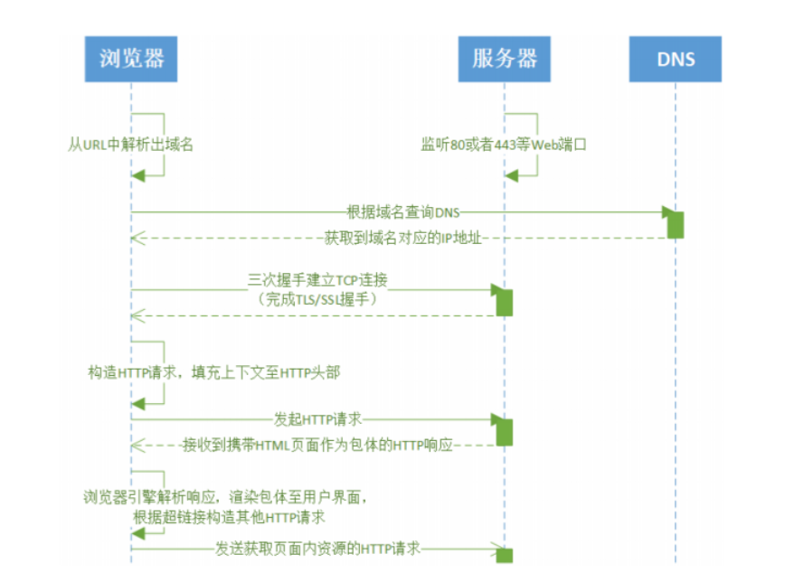
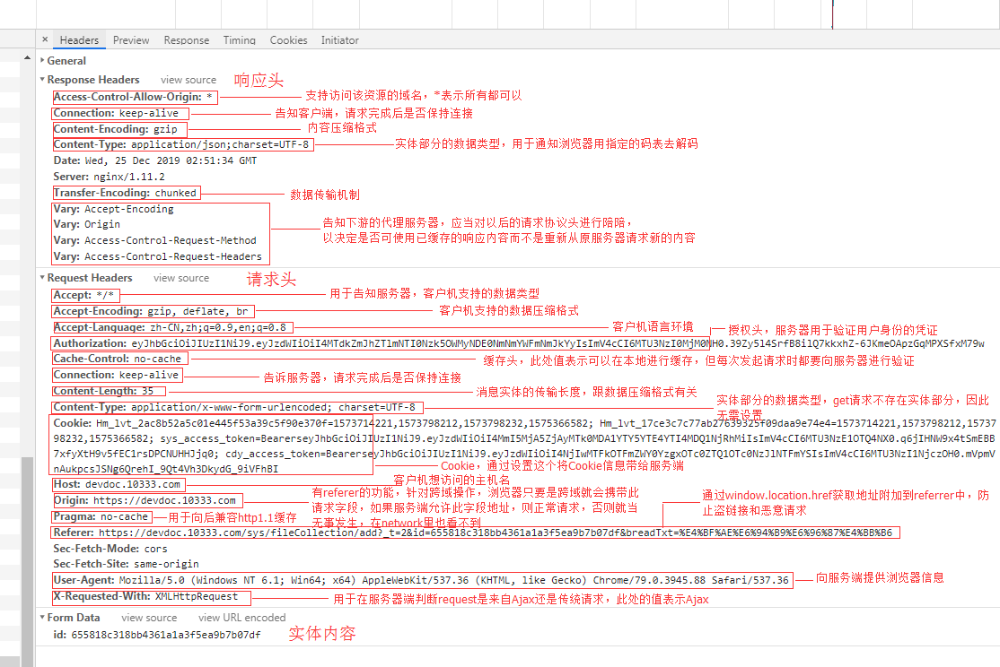
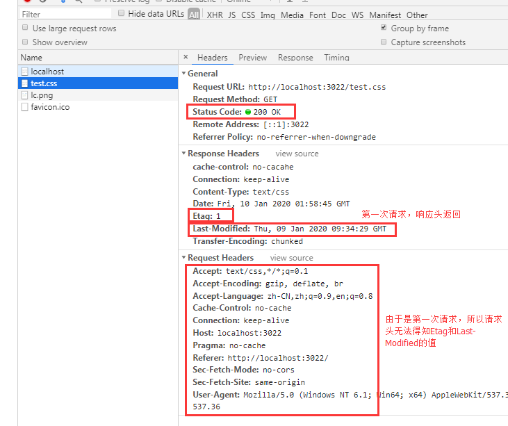
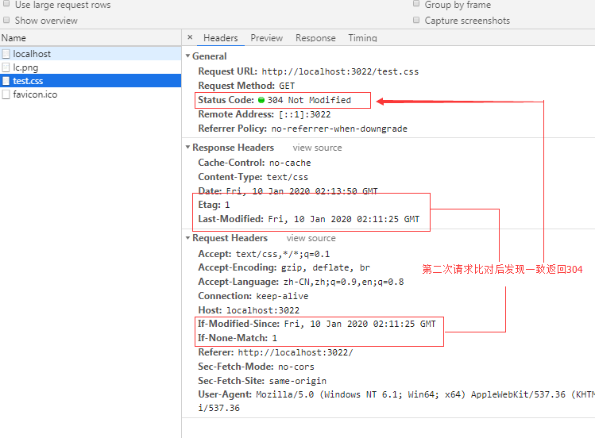
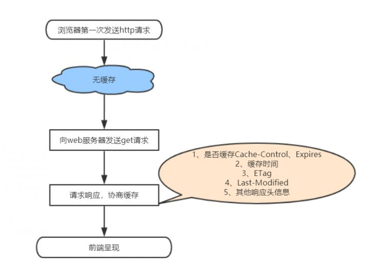
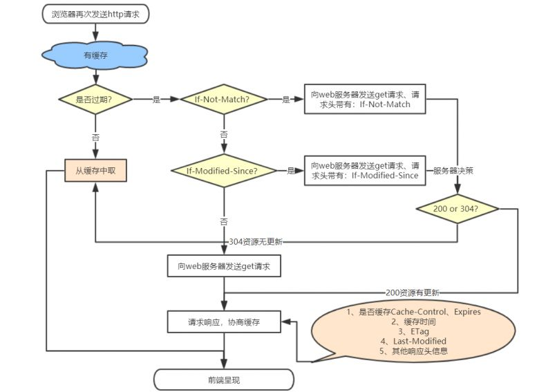
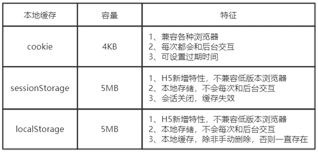

### 一、HTTP协议
[RFC2616](https://datatracker.ietf.org/doc/rfc2616/?include_text=1) 
[RFC2616中文版](https://blog.csdn.net/runner_diego/article/details/51379116) 
http协议（Hypertext Transfer Protocol，超文本传输协议），指就是浏览器和服务器之间进行“沟通”的一种规范。是一种用于分布式、协作式和超媒体信息系统的应用层协议。 
HTTP协议采用了请求/响应模型。客户端向服务器发送一个请求，请求头包含请求的方法、URI、协议版本、以及包含请求修饰符、客户信息和内容的类似于MIME的消息结构。服务器以一个状态行作为响应，相应的内容包括消息协议的版本，成功或者错误编码加上包含服务器信息、实体元信息以及可能的实体内容。 
http是属于“应用层的协议”，而且是基于[TCP/IP](https://developer.51cto.com/art/201906/597961.htm)协议的,[socket网络编程](https://blog.csdn.net/start_mao/article/details/86668591)中[TCP](https://blog.csdn.net/sinat_36629696/article/details/80740678)和[UDP](https://blog.csdn.net/aa1928992772/article/details/85240358)是两种使用广泛的通信协议（建立连接、三次握手等等） 
既然TCP/UDP是被广泛使用的网络通信协议，那http相对来说有什么独特的地方吗？ 
首先UDP协议具有不可靠性和不安全性，TCP协议是基于连接和三次握手的，虽然具有可靠性，但对于大型B/S架构的网站来说，这对服务器会造成很大负载压力。 
而http协议基于TCP的可靠性连接。在请求之后，服务器端会立即关闭连接、释放资源。这样既有TCP的可靠性的优点，也能很大程度上减轻服务器的负载。 

##### 1.工作原理(HTTP 请求/响应的步骤)
1. 建立连接： HTTP客户端(通常是浏览器)连接到Web服务器，与Web服务器的HTTP端口（默认为80）建立一个TCP套接字连接。
2. 发送HTTP请求：通过TCP套接字连接，客户端向Web服务器发送一个文本的请求报文，一个请求报文由请求行、请求头部、空行和请求数据4部分组成。
3. 服务器接受请求并返回HTTP响应：Web服务器解析请求，定位请求资源。服务器将资源复本写到TCP套接字，由客户端读取。一个响应由状态行、响应头部、空行和响应数据4部分组成。
4. 释放连接：若connection模式为close，则服务器主动关闭TCP连接，客户端被动关闭连接，释放TCP连接;若connection模式为keepalive，则该连接会保持一段时间，在该时间内可以继续接收请求;
5. 客户端浏览器解析HTML内容：客户端浏览器首先解析状态行，查看表明请求是否成功的状态代码。然后解析每一个响应头，响应头告知以下为若干字节的HTML文档和文档的字符集。客户端浏览器读取响应数据HTML，根据HTML的语法对其进行格式化，并在浏览器窗口中显示。 

ps：HTTP是一种不保存状态,即无状态(stateless)协议。HTTP协议自身不对请求和响应之间的通信状态进行保存。也就是说在HTTP这个级别,协议对于发送过的请求或响应都不做持久化处理(即不能单纯地通过http协议获取前面通过http请求或响应的内容)。http协议规定每次连接只处理一个请求，服务器处理完客户的请求，并收到客户的应答后，即断开连接，早期的http协议是一个请求一个响应之后，直接就断开了，但是现在的http协议1.1版本不是直接就断开了，而是等几秒钟（默认3秒，服务端可配置）
##### 1. HTTP请求方法
[MDN](https://developer.mozilla.org/zh-CN/docs/Web/HTTP/Methods/DELETE/)
方法 | 描述
---|---
GET | 请求指定的页面信息，并返回实体主体
HEAD | 类似于 GET 请求，只不过返回的响应中没有具体的内容，用于获取报头
POST | 向指定资源提交数据进行处理请求（例如提交表单或者上传文件）。 数据被包含在请求体中。POST 请求可能会导致新的资源的 建立或已有资源的修改。
PUT | 从客户端向服务器传送的数据取代指定的文档的内容。 （post新增，put更新）
DELETE | 请求服务器删除指定的页面。
CONNECT | HTTP/1.1 协议中预留给能够将连接改为管道方式的代理服务器。 （把服务器作为跳板，让服务器代替用户去访问其它网页， 之后把数据原原本本的返回给用户，网页开发上用不到）
OPTIONS | 允许客户端查看服务器的性能
TRACE   | 回显服务器收到的请求，主要用于测试或诊断。
PATCH   | 是对 PUT 方法的补充，用来对已知资源进行局部更新。
ps:前三个是属于HTTP1.0的，后面的均是HTTP1.1增加的。

##### 2. HTTP响应头和请求头信息

响应头 | 说明
---|---
Allow | 服务器支持哪些请求方法（如GET、POST等）
Content-Encoding | 文档的编码（Encode）方法。只有在解码之后才可以得到 Content-Type头指定的内容类型。
Content-Length | 表示内容长度。
Content-Type | 表示后面的文档属于什么MIME类型。Servlet默认为text/plain， 但通常需要显式地指定为text/html。
Date | 当前的GMT时间
Expires | 应该在什么时候认为文档已经过期，从而不再缓存它 （接收一个GMT时间）
Last-Modified | 文档的最后改动时间（GMT）
Location | 表示客户应当到哪里去提取文档，用于重定向接受者到一个新的位置
Refresh | 表示浏览器应该在多少时间之后刷新文档，单位秒。
Server | 服务器名字。Servlet一般不设置这个值，而是由Web服务器自己设置。
Set-Cookie | 设置和页面关联的Cookie
Transfer-Encoding | 告诉浏览器数据的传送格式

请求头 | 说明
---|---
Accept | 浏览器希望接受的数据类型
Accept-Charset |浏览器可接受的字符集（utf-8、iso-8859-15、 *）
Accept-Encoding | 浏览器能够进行解码的数据编码方式，比如gzip。
Accept-Language | 浏览器希望的语言（zh-cn;q=1;de-DE;q=0.5表示支持 简体中文和德语，优先简体中文， q权重，指向';'前的语言类型,0<q<1）
Authorization | 授权信息
Content-Length | 表示请求消息正文的长度
Host | 当一个ip地址对应多个域名时，服务器接收到来自浏览器的请求时，会根据请求头中的host字段访问哪个站点
If-Modified-Since | 客户机通过这个头告诉服务器，资源的缓存时间。 只有当所请求的内容在指定的时间后又经过修改才返回它， 否则返回304“Not Modified”应答。(GMT)
If-None-Match | 和If-Modified-Since用意差不多，不过不是根据时间来确定， 而是根据[ETag](https://baike.baidu.com/item/ETag/4419019?fr=aladdin)的东西来确定
If-Range | 告诉服务器如果这个资源没有更改过(根据If-Range后面给出 的Etag判断)，就发送这个资源中在浏览器缺少了的某些部分给浏览器， 如果该资源以及被修改过，则将整个资源重新发送一份给浏览器。
If-Unmodified-Since | 询问服务器现在正在请求的资源在某个时刻 以来是否没有被修改过（GMT）
Max-Forwards | 限制请求信息在代理服务器或网关中向前传递的次数
Referer | 客户机通过这个头告诉服务器， 它是从哪个资源来访问服务器的(防盗链)。 包含一个URL，用户从该URL代表的页面出发访问当前请求的页面。
User-Agent | User-Agent头域的内容包含发出请求的用户信息。浏览器类型
Cookie | 客户机通过这个头可以向服务器带数据
Pragma | 指定“no-cache”值表示服务器必须返回一个刷新后的文档， 即使它是代理服务器而且已经有了页面的本地拷贝。
From | 请求发送者的email地址
Upgrade | 请求服务器更新至另外一个协议，例如：Upgrade: HTTP/2.0
Range | 在HTTP头中，”Range”字眼都表示“资源的byte 形式数的顺序排列，并且取其某一段数据”的意思。 Range头就是表示请求资源的从某个数值到某个数值间 的数据，例如：Range: bytes=500-999 就是表示请求资源从500到999byte的数据。
Connection | 处理完这次请求后是否断开连接还是继续保持连接 (close/Keep- Alive)
Referer | 指当前请求的URL是在什么地址引用的
DNT | DO NOT TRACK的缩写，要求服务器程序不要跟踪记录用户信息。 1表示开启，0关闭
X-Requested-With | 主要是用来识别ajax请求 （值为XMLHttpRequest表示ajax，null表示传统同步请求）
Cache-Control | 缓存控制，参数说明见表（请求头Cache-Control参数说明）

请求头Cache-Control参数说明：
Cache-Control参数 | 说明
---|---
public | 所有内容都将缓存（客户端和代理服务器都可以）
private |只缓存到私有缓存（仅客户端）
no-store | 不缓存
no-cache | 表示浏览器可以缓存响应文件，但是在使用缓存之前，必须通过令牌（Etag）来与服务器进行沟通确认缓存有效
no-transform | 代理不可更改媒体类型
only-if-cached | 从缓存获取资源
max-age=xx | 缓存生效时间（缓存内容在xx秒后失效）

响应头Cache-Control参数说明：
Cache-Control参数 | 说明
---|---
public | 所有内容都将缓存（客户端和代理服务器都可以）
private |只缓存到私有缓存（仅客户端）
no-store | 不缓存
no-cache | 表示浏览器可以缓存响应文件，但是在使用缓存之前，必须通过令牌（Etag）来与服务器进行沟通确认缓存有效
no-transform | 代理不可更改媒体类型
must-revalidate/proxy-revalidate | 如果缓存内容失效，请求必须发送到服务器/代理进行重新验证
max-age=xx | 缓存生效时间（缓存内容在xx秒后失效）
s-maxage=xx | 公共缓存服务器缓存生效时间

http请求头和相应头含义以电子档案的接口为例： 
 

### 二、HTTP缓存（只缓存get请求响应的资源）
http缓存指的是: 当客户端向服务器请求资源时，会先到浏览器缓存中查找，如果浏览器有当次请求需要的资源的副本，就会直接从浏览器缓存中拿到该数据并返回，而不用再一次向服务器发起请求获取这个资源。 
http缓存从第二次请求开始的。第一次请求资源时，服务器返回资源，并在响应头中返回资源的缓存参数；第二次请求时，浏览器判断这些请求参数，命中强缓存就直接200，否则就把请求参数加到request header头中传给服务器，看是否命中协商缓存，命中则返回304，否则服务器会返回新的资源。

##### 1. 缓存分类
http缓存分为强制缓存和协商缓存两种，强制缓存表示如果缓存生效，则不再同服务端进行交互，直接取浏览器上的；而协商缓存则是不管缓存是否生效，都会与服务端发生缓存。两种缓存的缓存位置都是在浏览器上的。 
为什么要使用HTTP缓存：
- 减少了冗余的数据传输
- 缓解了服务器的压力， 大大提高网站的性能
- 加快客户端加载网页的速度

  | 强制缓存 | 协商缓存
---|--- |---
HTTP状态码 | 200 | 304
区分的响应头 | Cache-Control Pragma Expires | ETag/If-None-Match Last-Modified/If-Modified-Since
操作是否能继续读取缓存 | F5（不能）  ctrl + F5（不能） 前进后退（能） 地址栏回车（能） 新开窗口（能） 链接跳转（能）  | F5（不能）  ctrl + F5（能） 前进后退（能） 地址栏回车（能） 新开窗口（能） 链接跳转（能） 

- <strong>强制缓存</strong> 
    强制缓存在缓存数据失效前会直接使用浏览器的缓存数据，不再向服务器发送任何请求。强制缓存生效的http状态码为200。这种方式页面的加载速度是最快的，性能也得到很大的提升，但在缓存数据失效前如果服务器端的资源修改了，由于此时依旧读的浏览器缓存，所以页面正常刷新或前进后跳跳转链接时并不会有更新。比如用了强缓存的情况下修改了页面上的某个样式，在页面上刷新了但没有生效。跟强制缓存相关的header头属性有：Pragma、Cache-Control、Expires。  
Pragma、Cache-Control、Expires常用属性说明：

属性 | 所属HTTP版本 | 可选值 | 优先级 | 优缺点
---|---|---|---|---
 Pragma | 1.0 | no-cache: 不直接使用缓存，根据资源新鲜度来使用缓存 | 高 | 1.兼容http1.0的客户端持 2.请求头不支 3.已被HTTP1.1废弃
 Cache-Control | 1.1 | 1.no-store， 不使用缓存 2.no-cache， 同Pragma：no-cache 3.max-age=XX， 缓存时长，XX表示秒 4.public,浏览器和代理服务器都可以缓存 5.private，只有发起请求的浏览器可以缓存，代理服务器（如nginx）不可以 6.must-revalidate，如果缓存内容失效，请求必须发送到服务器 | 中 | 1.请求头和响应头都支持该属性 2.http1.0不支持 3.缓存未失效前，获取不到修改后的资源
 Expires | 1.0及以上 | GMT时间 | 低 | 1.http1.0和1.1都支持 2.当客户端时间和服务器时间不一致时会有问题 3.缓存未失效前，获取不到修改后的资源
 
-  <strong>协商缓存</strong> 
  当第一次请求时服务器返回的响应头中没有Cache-Control和Expires或者Cache-Control和Expires过期还或者它的属性设置为no-cache时(即不走强缓存)，那么浏览器第二次请求时就会与服务器进行协商，与服务器端对比判断资源是否进行了修改更新。如果服务器端的资源没有修改，那么就会返回304状态码，告诉浏览器可以使用缓存中的数据，这样就减少了服务器的数据传输压力。如果数据有更新就会返回200状态码，服务器就会返回更新后的资源并且将缓存信息一起返回。跟协商缓存相关的响应头/请求头属性有：Etag/If-Not-Match 、Last-Modified/If-Modified-Since。（<strong>请求头和响应头需要成对出现</strong>） 
  执行流程：浏览器第一次向服务器发送请求时，服务器响应时会在响应头返回头属性Etag或Last-Modified（根据实际情况需要确认返回哪一个，也可两个都有），其中Etag通常返回一个hash值（文件名+文件最后修改日期），Last-Modified返回文件的最后修改时间（<strong>GMT格式</strong>）。之后浏览器在第二次请求时会在请求头上带上If-Not-Match（对应第一次请求响应头ETag的值）和If-Modified-Since（对应第一次请求响应头Last-Modified的值），服务器在接受到这两个参数后会再一次获取文件信息来做比较，如果一致则返回304状态码，告知浏览器资源没有发生修改，可以直接继续拿缓存的来用，否则返回200状态码以及新的数据。

  PS：
- Last-Modified标注的最后修改只能精确到秒级，如果某些文件在1秒钟以内被修改多次的话，它将不能准确标注文件的修改时间
- 如果某些文件被修改了，但是内容并没有任何变化，而Last-Modified却改变了，导致文件没法使用缓存

总结： 
浏览器第一次发起请求：

浏览器第二次发起请求：

- 浏览器缓存

