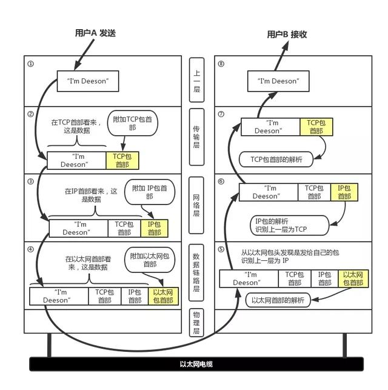
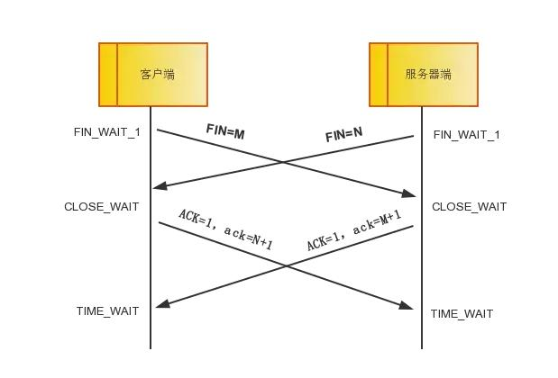
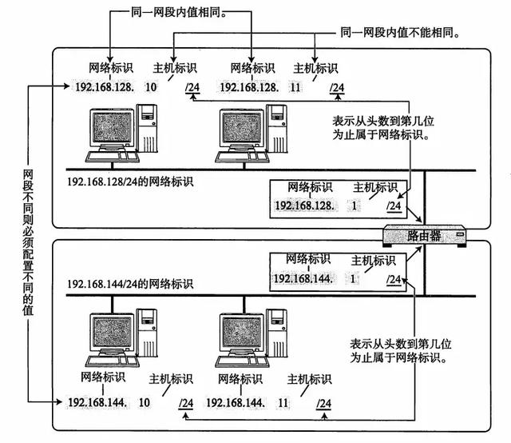
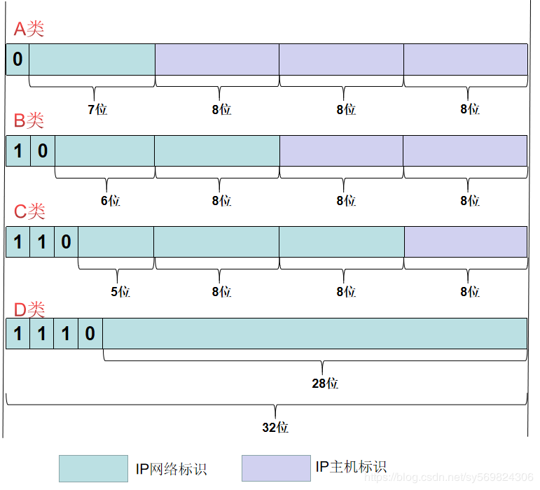

### TCP/IP协议
从字面意义上讲，有人可能会认为 TCP/IP 是指 TCP 和 IP 两种协议。实际生活当中有时也确实就是指这两种协议。然而在很多情况下，它只是利用 IP 进行通信时所必须用到的协议群的统称。具体来说，IP 或 ICMP、TCP 或 UDP、TELNET 或 FTP、以及 HTTP 等都属于 TCP/IP 协议。(在此详细讲TCP和IP) 
互联网进行通信时，需要相应的网络协议，TCP/IP原本就是为使用互联网而开发制定的协议族。因此，<strong>互联网的协议就是 TCP/IP，TCP/IP 就是互联网的协议</strong>。

##### 1. TCP/IP概念层模型与OSI七层模型结构分层
OSI七层模型 | TCP/IP概念层模型 | 功能 | TCP/IP协议族
---|---|---|---|---
应用层 | 应用层 | 文件传输，电子邮件，文件服务，虚拟终端 | TFTP,HTTP,SNMP,DNS,Telnet
表示层 | 应用层 | 数据格式化，代码转换，数据加密 | 无
会话层 | 应用层 | 解除或建立与别的接点的联系 | 无
传输层 | 传输层 | 提供端对端的接口 | TCP,UDP
网络层 | 网络层 | 为数据包选择路由器 | IP,ICMP,RIP,OSPF,BCP,IGMP
数据链路层 | 链路层 | 传输有地址的帧以及错误检测功能 | SLIP.CSLP,PPP,ARP,RARP,MTU
物理层 | 链路层 | 以二进制数据形式在物理媒体上传输数据 | ISO2110,IEEE802.IEEE802.2

每个分层中，都会对所发送的数据附加一个首部，在这个首部中包含了该层必要的信息，如发送的目标地址以及协议相关信息。通常，为协议提供的信息为包首部，所要发送的内容为数据。<strong>在下一层的角度看，从上一层收到的包全部都被认为是本层的数据</strong>。 

##### 2.传输层中的TCP
TCP 是面向连接的、可靠的流协议。流就是指不间断的数据结构，当应用程序采用 TCP发送消息时，虽然可以保证发送的顺序，但还是犹如没有任何间隔的数据流发送给接收端。TCP 为提供可靠性传输，实行“顺序控制”或“重发控制”机制。此外还具备“流控制（流量控制）”、“拥塞控制”、提高网络利用率等众多功能。 
- TCP的状态： 
  在TCP层，有个FLAGS字段，这个字段有以下几个标识：SYN, FIN, ACK, PSH, RST 
  SYN（初始序列号）表示建立连接；FIN表示关闭连接；ACK(确认应答)表示响应；PSH表示有 DATA数据传输；RST表示连接重置。 
  其中ACK是可能与SYN，FIN等同时使用的，比如SYN和ACK可能同时为1，它表示的就是建立连接之后的响应， 如果只是单个的一个SYN，它表示的只是建立连接； 
  SYN与FIN是不会同时为1的，因为前者表示的是建立连接，而后者表示的是断开连接； 
  RST一般是在FIN之后才会出现为1的情况，表示的是连接重置；一般地，当出现FIN包或RST包时，我们便认为客户端与服务器端断开了连接；而当出现SYN和SYN＋ACK包时，我们认为客户端与服务器建立了一个连接。 
  PSH为1的情况，一般只出现在DATA内容不为0的包中，也就是说PSH为1表示的是有真正的TCP数据包内容被传递。
- 三次握手： 
  所谓三次握手是指建立一个 TCP 连接时需要客户端和服务器端总共发送三个包以确认连接的建立。在socket编程中，这一过程由客户端执行connect来触发。

ps: seq和ack号存在于TCP报文段的首部中，seq是序号，ack是确认号，大小均为4字节  
第一次握手：客户端发送位码为SYN＝1，随机产生seq number=J的数据包到服务器，服务端由SYN=1知道，客户端要求建立联机；得出结论：客户端的发送能力、服务端的接收能力是正常的。
 
第二次握手：服务端收到请求后要确认联机信息，向客户端发送ack number=(客户端的seq+1)，SYN=1，ACK=1，随机产生seq=K的包；服务端的接收、发送能力，客户端的接收、发送能力是正常的。不过此时服务器并不能确认客户端的接收能力是否正常。
 
第三次握手：客户端收到后检查ack number是否正确，即第一次发送的seq number+1，以及位码ASK是否为1，若正确，客户端会再发送ack number=(服务端的seq+1)，ACK=1，服务端收到后确认seq值与ACK=1则连接建立成功。得出结论：客户端的接收、发送能力正常，服务器自己的发送、接收能力也正常。

- 四次挥手 
  四次挥手即终止TCP连接，就是指断开一个TCP连接时，需要客户端和服务端总共发送4个包以确认连接的断开。在socket编程中，这一过程由客户端或服务端任一方执行close来触发。由于TCP连接是全双工的，因此，每个方向都必须要单独进行关闭，这一原则是当一方完成数据发送任务后，发送一个FIN来终止这一方向的连接，收到一个FIN只是意味着这一方向上没有数据流动了，即不会再收到数据了，但是在这个TCP连接上仍然能够发送数据，直到这一方向也发送了FIN。首先进行关闭的一方将执行主动关闭，而另一方则执行被动关闭。

第一次挥手：客户端发送一个FIN=M，用来关闭客户端到服务器端的数据传送，客户端进入FIN_WAIT_1状态。意思是说"我客户端没有数据要发给你了"，但是如果你服务器端还有数据没有发送完成，则不必急着关闭连接，可以继续发送数据。 
第二次挥手：服务器端收到FIN后，先发送ack=M+1，告诉客户端，你的请求我收到了，但是我还没准备好（可能还有数据要发送），请继续你等我的消息。这个时候客户端就进入FIN_WAIT_2 状态，继续等待服务器端的FIN报文。 
第三次挥手：当服务器端确定数据已发送完成，则向客户端发送FIN=N报文，告诉客户端，好了，我这边数据发完了，准备好关闭连接了。服务器端进入LAST_ACK状态。 
第四次挥手：客户端收到FIN=N报文后，就知道可以关闭连接了，但是他还是不相信网络，怕服务器端不知道要关闭，所以发送ack=N+1后进入TIME_WAIT状态，如果服务端没有收到ACK则可以重传。服务器端收到ACK后，就知道可以断开连接了。客户端等待了[2MSL](https://blog.csdn.net/tennysonsky/article/details/48680197)后依然没有收到回复，则证明服务器端已正常关闭，那好，我客户端也可以关闭连接了。最终完成了四次握手。 
实际中还会出现同时主动发起关闭的情况：

##### 3. 网络层中的IP协议
IP（IPv4、IPv6）相当于OSI参考模型中的第三层——网络层。网络层的主要作用是“实现终端节点之间的通信”。这种终端节点之间的通信也叫“点对点通信”。 
网络层的下一层——数据链路层的主要作用是在互连同一种数据链路的节点之间进行包传递。而一旦跨越多种数据链路，就需要借助网络层。网络层可以跨越不同的数据链路，即使是在不同的数据链路上也能实现两端节点之间的数据包传输。 
IP 大致分为三大作用模块，它们是 IP 寻址、路由（最终节点为止的转发）以及 IP 分包与组包。 
- <strong>IP 地址用于在“连接到网络中的所有主机中识别出进行通信的目标地址”。</strong> 
- <strong>IP 地址（IPv4 地址）由32位正整数来表示。</strong> 
  IP地址在计算机内部以二进制方式被处理。为了便于我们记忆读取将32位的 IP 地址以每8位为一组，分成4组，每组以 “.”隔开，再将每组数转换成十进制数。如ip： 192.168.30.68实际上在计算机处理时是转成二进制
  11000000.10101000.00011110.01010110 => 11000000101010000001111001010110
- <strong>IP 地址由网络标识和主机标识两部分标识组成</strong> 
  网络标识在数据链路的每个段配置不同的值。网络标识必须保证相互连接的每个段的地址不相重复。而相同段内相连的主机必须有相同的网络地址。IP 地址的“主机标识”则不允许在同一个网段内重复出现。由此，可以通过设置网络地址和主机地址，在相互连接的整个网络中保证每台主机的 IP 地址都不会相互重叠。即 IP 地址具有了唯一性。

- <strong>ip地址的分类</strong> 
- IP 地址分为四个级别，分别为A类、B类、C类、D类。它根据 IP 地址中从第 1 位到第 4 位的比特列对其网络标识和主机标识进行区分。 
  A 类 IP 地址是首位以 “0” 开头的地址。从第 1 位到第 8位是它的网络标识。用十进制表示的话，0.0.0.0~127.0.0.0 是 A 类的网络地址。A 类地址的后 24 位相当于主机标识。因此，一个网段内可容纳的主机地址上限为16,777,214个。 
  B 类 IP 地址是前两位 “10” 的地址。从第 1 位到第 16位是它的网络标识。用十进制表示的话，128.0.0.0~191.255.0.0 是 B 类的网络地址。B 类地址的后 16 位相当于主机标识。因此，一个网段内可容纳的主机地址上限为65,534个。 
  C 类 IP 地址是前三位为 “110” 的地址。从第 1 位到第 24 位是它的网络标识。用十进制表示的话，192.0.0.0~223.255.255.0 是 C 类的网络地址。C 类地址的后 8 位相当于主机标识。因此，一个网段内可容纳的主机地址上限为254个。 
  D 类 IP 地址是前四位为 “1110” 的地址。从第 1 位到第 32 位是它的网络标识。用十进制表示的话，224.0.0.0~239.255.255.255 是 D 类的网络地址。D 类地址没有主机标识，常用于多播。
  
  问：为啥A-C类可容纳主机地址都少了两个？ 
  答: 用比特位表示主机地址时，不可以全部为0或全部为1。因为全部为0在表示对应的网络地址或IP地址不可获知的情况下才使用。而全部为1的主机地址通常作为广播地址
- <strong>广播地址</strong> 
  广播地址(Broadcast Address)是专门用于同时向网络中所有工作站进行发送的一个地址。在使用TCP/IP 协议的网络中，主机标识为全1 的IP 地址为广播地址，广播的分组传送给主机段所涉及的所有计算机。
- <strong>多播</strong> 
  IP多播（也称多址广播或组播）技术，是一种允许一台或多台主机（多播源）发送单一数据包到多台主机（一次的，同时的）的TCP/IP网络技术。多播作为一点对多点的通信，是节省网络带宽的有效方法之一。在网络音频/视频广播的应用中，当需要将一个节点的信号传送到多个节点时，无论是采用重复点对点通信方式，还是采用广播方式，都会严重浪费网络带宽，只有多播才是最好的选择。多播能使一个或多个多播源只把数据包发送给特定的多播组，而只有加入该多播组的主机才能接收到数据包。目前，IP多播技术被广泛应用在网络音频/视频广播、AOD/VOD、网络视频会议、多媒体远程教育、“push”技术（如股票行情等）和虚拟现实游戏等方面。
- <strong>子网掩码</strong> 
  子网掩码(subnet mask)又叫网络掩码、地址掩码、子网络遮罩，它是一种用来指明一个IP地址的哪些位标识的是主机所在的子网，以及哪些位标识的是主机的位掩码。子网掩码不能单独存在，它必须结合IP地址一起使用。子网掩码只有一个作用，就是将某个IP地址划分成网络地址和主机地址两部分。 
  根据RFC950定义，子网掩码是一个32位的2进制数， 其对应网络地址的所有位都置为1，对应于主机地址的所有位都置为0。子网掩码告知路由器，地址的哪一部分是网络地址，哪一部分是主机地址，使路由器正确判断任意IP地址是否是本网段的，从而正确地进行路由。网络上，数据从一个地方传到另外一个地方，是依靠IP寻址。从逻辑上来讲，是两步的。第一步，从IP中找到所属的网络，好比是去找这个人是哪个小区的；第二步，再从IP 中找到主机在这个网络中的位置，好比是在小区里面找到这个人。 
  子网掩码的设定必须遵循一定的规则。与二进制IP地址相同，子网掩码由1和0组成，且1和0分别连续。子网掩码的长度也是32位，左边是网络位，用二进制数字“1”表示，1的数目等于网络位的长度；右边是主机位，用二进制数字“0”表示，0的数目等于主机位的长度。这样做的目的是为了让掩码与IP地址做按位与运算时用0遮住原主机数，而不改变原网络段数字，而且很容易通过0的位数确定子网的主机数。 
  

类别 | 子网掩码二进制 | 子网掩码十进制
---|---|---
A | 11111111 00000000 00000000 00000000 | 255.0.0.0
B | 11111111 11111111 00000000 00000000 | 255.255.0.0
C | 11111111 11111111 11111111 00000000 | 255.255.255.0

问： 子网掩码为255.255.0.0，ip为192.168.30.86，求网络标识段和主机标识段及该网络最多可以配置多少个ip
