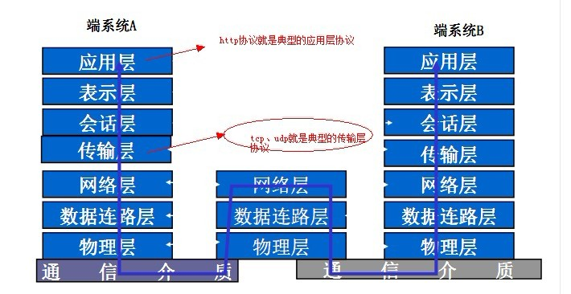

### 七层协议
（也有五层协议，五层协议中把七层协议的表示层、会话层合并到应用层）

（ps: [OSI七层协议](https://blog.csdn.net/taotongning/article/details/81352985)） 
- 应用层：负责解决业务问题，协议有：HTTP FTP TFTP SMTP SNMP DNS TELNET HTTPS POP3 DHCP
- 表示层：负责把网络中的消息转换成应用层可以读取的消息，数据的表示，格式有，JPEG、ASCll、DECOIC、加密格式等
- 会话层：负责建立会话、握手、维持连接、关闭，对应主机进程，指本地主机与远程主机正在进行的会话
- 传输层：负责解决进程与进程之间的通信，例如TCP保证报文的可达性和流量的控制，定义传输数据的协议端口号，以及流控和差错校验。协议有：TCP UDP，数据包一旦离开网卡即进入网络传输层
- 网络层：进行逻辑地址寻址，实现不同网络之间的路径选择，协议有：ICMP IGMP IP（IPV4 IPV6）
- 数据链路层：负责局域网中根据MAC地址连接的相应的交换机/路由器进行报文的转发
- 物理层：物理传输介质

OSI七层模型 | TCP/IP概念层模型 | 功能 | TCP/IP协议族
---|---|---|---|---
应用层 | 应用层 | 文件传输，电子邮件，文件服务，虚拟终端 | TFTP,HTTP,SNMP,DNS,Telnet
表示层 | 应用层 | 数据格式化，代码转换，数据加密 | 无
会话层 | 应用层 | 解除或建立与别的接点的联系 | 无
传输层 | 传输层 | 提供端对端的接口 | TCP,UDP
网络层 | 网络层 | 为数据包选择路由器 | IP,ICMP,RIP,OSPF,BCP,IGMP
数据链路层 | 链路层 | 传输有地址的帧以及错误检测功能 | SLIP.CSLP,PPP,ARP,RARP,MTU
物理层 | 链路层 | 以二进制数据形式在物理媒体上传输数据 | ISO2110,IEEE802.IEEE802.2

