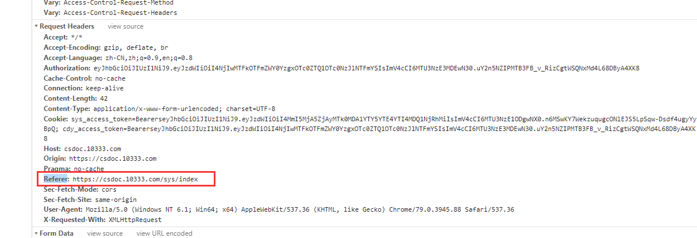

### 一、XSS (Cross-Site Scripting)，跨站脚本攻击
XSS的原理是攻击者向Web页面中插入可执行的网页脚本代码，在用户浏览该页的时候这些的脚本代码就会被执行，从而可以达到攻击者盗取用户信息或其他侵犯用户安全隐私的目的。<br/>
XSS可能造成的影响:
- 利用虚假输入表单骗取用户个人信息;
- 利用脚本窃取用户的Cookie值，被害者在不知情的情况下，帮助攻击者发送恶意请求;
- 显示伪造的文章或图片。

XSS大致可以分为以下两类：
1. 非持久型 XSS（反射型 XSS ）<br/>
   非持久型 XSS 漏洞，一般是通过给别人发送带有恶意脚本代码参数的 URL，当 URL 地址被打开时，特有的恶意代码参数被 HTML 解析、执行。<br/>
```
sequenceDiagram
用户->>浏览器: XSS脚本链接
浏览器->>用户: XSS脚本链接
浏览器->>Web应用程序: 请求数据
Web应用程序->>浏览器: 返回到浏览器
```

如有以下代码：
   
```
//从URL上读取title并设值到xxDom中
xxDom.innerHTML = this.props.location.quert.title;
```
恶意攻击者可以通过改变URL上的参数来注入可执行的脚本代码进来，如：<br/>

```
https://dsyjg.10333.com/index?title=<script>alert(document.cookie)</script>
```
非持久型 XSS（反射型 XSS ）的特征：
- 即时性，不经过服务器存储，直接通过 HTTP 的 GET 和 POST 请求就能完成一次攻击，拿到用户隐私数据。
- 攻击者需要诱骗点击,必须要通过用户点击链接才能发起
- 反馈率低，所以较难发现和响应修复
- 盗取用户敏感保密信息

防范：
- Web 页面渲染的所有内容或者渲染的数据都必须来自于服务端。
- 尽量不要从 URL，document.referrer，document.forms 等这种 DOM API 中获取数据直接渲染。
- 尽量不要使用 eval, new Function()，document.write()，document.writeln()，window.setInterval()，window.setTimeout()，innerHTML，document.createElement() 等可执行字符串的方法。
- 如果做不到以上几点，也必须对涉及 DOM 渲染的方法传入的字符串参数做 escape 转义。

escape转义方法：

```
function escape(str) {
  str = str.replace(/&/g, '&amp;');
  str = str.replace(/</g, '&lt;');
  str = str.replace(/>/g, '&gt;');
  str = str.replace(/"/g, '&quto;');
  str = str.replace(/'/g, '&#39;');
  str = str.replace(/`/g, '&#96;');
  str = str.replace(/\//g, '&#x2F;');
  return str;
}
```

2. 持久型 XSS（存储型 XSS）<br/>
   持久型 XSS 漏洞，一般存在于Form表单提交等交互功能，如文章留言，提交文本信息等，黑客利用的 XSS漏洞，将内容经正常功能提交进入数据库持久保存，当前端页面获得后端从数据库中读出的注入代码时，恰好将其渲染执行。

例如：<br/>
<br/>
假如上述代码在查看页面数据回填的时候直接塞到某个dom下的innerHTML下，那么便会执行里面的脚本代码，从而让攻击者读取的用户的一些信息。<br/><br/>
主要注入页面方式和非持久型 XSS 漏洞类似，只不过持久型的不是来源于 URL，referer，forms 等，而是来源于后端从数据库中读出来的数据 。持久型 XSS 攻击不需要诱骗点击，黑客只需要在提交表单的地方完成注入即可，但是这种 XSS 攻击的成本相对还是很高。<br/><br/>
攻击成功需要同时满足以下几个条件：

- POST 请求提交表单后端没做转义直接入库。
- 后端从数据库中取出数据没做转义直接输出给前端。
- 前端拿到后端数据没做转义直接渲染成 DOM。<br/>

持久型 XSS 有以下几个特点：

- 持久性，植入在数据库中
- 盗取用户敏感私密信息
- 危害面广

3. 防御XSS <br/>
（1）. CSP <br/>
CSP 本质上就是建立白名单，开发者明确告诉浏览器哪些外部资源可以加载和执行。我们只需要配置规则，如何拦截是由浏览器自己实现的。我们可以通过设置 HTTP Header 中的 Content-Security-Policy和设置 meta 标签的方式来尽量减少 XSS 攻击。<br/>

<span style="margin-left: 4rem">A.设置 HTTP Header<span>

```
Content-Security-Policy: default-src 'self' //a.只允许加载本站资源
```

```
Content-Security-Policy: default-src 'self' *.xxx.com // 允许内容来自信任的域名及其子域名
```

```
Content-Security-Policy: default-src 'self'; img-src *;media-src youku.com //允许网页应用的用户在他们自己的内容中包含来自任何源的图片 允许内容来自信任的域名及其子域名,视频只允许来自youku.com
```
<span style="margin-left: 4rem">B. 设置 meta 标签<span>

```
<meta http-equiv="Content-Security-Policy" content="default-src https:">
```
[更多CSP配置请点击此处](https://developer.mozilla.org/en-US/docs/Web/HTTP/Headers/Content-Security-Policy)

<span style="margin-left: 2rem">（2）. 转义字符</span><br/>
<div style="margin-left: 4rem">对于一般的用户输入以及处理数据处理方法上文已经提到了用escape转义方法处理，但对于富文本来说，转义会导致填充回去的内容无法正常识别，这时使用白名单过滤方法（像百度编辑器的配置文件里的whitList），我们也可以用xss包来进行过滤处理：</div><br/>

```
const xss = require('xss')
let html = xss('<h1 id="title">XSS Demo</h1><script>alert("xss");</script>')
// -> <h1>XSS Demo</h1>&lt;script&gt;alert("xss");&lt;/script&gt;
console.log(html)
```

[xss文档](https://www.npmjs.com/package/xss)

<span style="margin-left: 2rem">（3）. 设置Cookie的HttpOnly（PS：由服务端设置） </span><br/>

```
//以java为例，服务端代码设置后客户端将不能对cookie进行读取修改
response.addHeader("Set-Cookie", "uid=112; Path=/; HttpOnly");
```

### 二、CSRF(Cross Site Request Forgery)
即跨站请求伪造，是一种常见的Web攻击，它利用用户已登录的身份，在用户毫不知情的情况下，以用户的名义完成非法操作。原理如下：<br/>
<br/>
- 用户已经登录了站点 A，并在本地记录了 cookie
- 在用户没有登出站点 A 的情况下（也就是 cookie 生效的情况下），访问了恶意攻击者提供的引诱危险站点 B (B 站点要求访问站点A)。
- 站点 A 没有做任何 CSRF 防御。
##### 防御：
- Get 请求不对数据进行修改
- 不让第三方网站访问到用户 Cookie：可以对 Cookie 设置 SameSite 属性。该属性表示 Cookie 不随着跨域请求发送，可以很大程度减少 CSRF 的攻击，但是该属性目前并不是所有浏览器都兼容。[点击查看](https://www.cnblogs.com/ziyunfei/p/5637945.html)
- 阻止第三方网站请求接口，HTTPReferer是header的一部分，当浏览器向web服务器发送请求时，一般会带上Referer信息（浏览器自带，当前页面路径）告诉服务器是从哪个页面链接过来的，服务器籍此可以获得一些信息用于处理。可以通过检查请求的来源来防御CSRF攻击。正常请求的referer具有一定规律，如在提交表单的referer必定是在该页面发起的请求。所以通过检查http包头referer的值是不是这个页面，来判断是不是CSRF攻击。
但在某些情况下如从https跳转到http，浏览器处于安全考虑，不会发送referer，服务器就无法进行check了。若与该网站同域的其他网站有XSS漏洞，那么攻击者可以在其他网站注入恶意脚本，受害者进入了此类同域的网址，也会遭受攻击。出于以上原因，无法完全依赖Referer Check作为防御CSRF的主要手段。但是可以通过Referer Check来监控CSRF攻击的发生。<br/>
<br/>

- 请求时附带验证信息，比如验证码或者 Token（参考我们城档云的ajax，该方式是目前比较完善的方案）

### 三、点击劫持
点击劫持是一种视觉欺骗的攻击手段。攻击者将需要攻击的网站通过iframe嵌套的方式嵌入自己的网页中，并将iframe设置为透明，在页面中透出一个按钮诱导用户点击。<br/>
特点：
- 隐蔽性较高，骗取用户操作
- "UI-覆盖攻击"
- 利用iframe或者其它标签的属性

```
<!DOCTYPE html>
<html lang="en">
  <head>
    <meta charset="utf-8" />
    <style>
      iframe, .test {
        width: 100%;
        height: 100%;
        position: absolute;
        top: -0px;
        left: -0px;
        z-index: 2;
        opacity: 0;
        background: #666;
      }
      button {
        position: absolute;
        top: 270px;
        left: 1150px;
        z-index: 1;
        width: 90px;
        height:40px;
      }
      img {
        width: 100%;
        height: 100%;
      }
    </style>
    <title>React App</title>
  </head>
  <body>
    <button onclick="money()">点击领钱</button>
    
    <div class="test">
      假装这个是iframe
      <button onclick="helloWord()">做梦</button>
    </div>
    <!-- <iframe src="http://i.youku.com" scrolling="no"></iframe> -->
  </body>
  <script>
    let helloWord = function () {
      window.alert('别做梦')
    }
    let money = function () {
      window.alert('恭喜你领到了一百万')
    }
  </script>
</html>
```
防御：<br/>
1. 配置相应头X-FRAME-OPTIONS，（三个属性：DENY：页面不能被嵌入到任何iframe或frame中；SAMEORIGIN：页面只能被本站页面嵌入到iframe或者frame中；ALLOW-FROM：页面允许frame或frame加载。）<br/>
(ps: 有兼容性问题，ie7及以下不支持)

```
//在服务端设置的方式如下：

//Java代码:
response.addHeader("x-frame-options","SAMEORIGIN");
//Nginx配置:
add_header X-Frame-Options SAMEORIGIN
//Apache配置:
Header always append X-Frame-Options SAMEORIGIN
```
2.通过js防御

```
<head>
  <style id="topStyle">
    html {
      display: none !important; //先直接把自己页面整个none掉
    }
  </style>
</head>
<body>
  <script>
    if (self == top) {
      //如果当前窗口跟顶层窗口一致，表示没被解除，则去掉上面设置的样式
      var style = document.getElementById('topStyle')
      document.head.removeChild(style)
    } else {
      //否则将窗口顶层的location设置为当前窗口的
      top.location = self.location
    }
  </script>
</body>
```

### 四、SQL注入
SQL注入是一种常见的Web安全漏洞，攻击者利用这个漏洞，可以访问或修改数据，或者利用潜在的数据库漏洞进行攻击。<br/><br/>
SQL注入例子：<br/>
<br/>
后端SQL代码可能：

```
let querySQL = `SELECT * FROM user WHERE username='${username}' AND psw='${password}'`;
```
如果此时有一个恶意攻击者输入的用户名是admin'--，密码随意输入，此时得到SQL代码如下：

```
//SQL语句中 -- 是单行注释
SELECT * FROM user WHERE username='admin'--' AND psw='xxxx'
```
一次SQL注入的过程包括以下几个过程：
- 获取用户请求参数
- 拼接到代码当中
- SQL语句按照我们构造参数的语义执行成功

SQL注入的必备条件：
- 可以控制输入的数据
- 服务器要执行的代码拼接了控制的数据


##### 防御：
- 严格限制Web应用的数据库的操作权限，给此用户提供仅仅能够满足其工作的最低权限，从而最大限度的减少注入攻击对数据库的危害
- 后端代码检查输入的数据是否符合预期，严格限制变量的类型，例如使用正则表达式进行一些匹配处理。
- 对进入数据库的特殊字符（'，"，，<，>，&，*，;等）进行转义处理，或编码转换。
- 所有的查询语句建议使用数据库提供的参数化查询接口，参数化的语句使用参数而不是将用户输入变量嵌入到 SQL 语句中，即不要直接拼接 SQL 语句


### OS命令注入攻击
OS命令注入和SQL注入差不多，只不过SQL注入是针对数据库的，而OS命令注入是针对操作系统的。OS命令注入攻击指通过Web应用，执行非法的操作系统命令达到攻击的目的。只要在能调用Shell函数的地方就有存在被攻击的风险。倘若调用Shell时存在疏漏，就可以执行插入的非法命令。


```
// 以 Node.js 为例，假如在接口中需要从 github 下载用户指定的 repo
const exec = require('mz/child_process').exec;
let params = {/* 用户输入的参数 */};
exec(`git clone ${params.repo} /some/path`);
```
如果 params.repo 传入的是 https://github.com/admin/admin.github.io.git 正常能从指定的 git repo 上下载到想要的代码。
但是如果 params.repo 传入的是 https://github.com/xx/xx.git && rm -rf /* && 且刚好的服务是用 root 权限的就原地爆炸了。

##### 防御
- 后端对前端提交内容进行规则限制（比如正则表达式）。
- 在调用系统命令前对所有传入参数进行命令行参数转义过滤。
- 不要直接拼接命令语句，借助一些工具做拼接、转义预处理，例如 Node.js 的 shell-escape npm包


### URL跳转漏洞

通过以GET或者POST的方式接收将要跳转的URL，然后通过上面的几种方式的其中一种来跳转到目标URL。一方面，由于用户的输入会进入Meta，javascript，http头所以都可能发生相应上下文的漏洞，如xss等等，但是同时，即使只是对于URL跳转本身功能方面就存在一个缺陷，因为会将用户浏览器从可信的站点导向到不可信的站点，同时如果跳转的时候带有敏感数据一样可能将敏感数据泄漏给不可信的第三方。

加入有以下url：

```
/**
 *登录成功后会跳转到http://www.evil.com,此时如果www.evil.com是个恶意网站
 *那么用户登录成功后的相关信息就会被该网站获取到
  *安全意识较低的用户很可能会以为该链接展现的内容是www.wooyun.org从而可能
  *产生欺诈行为，同时由于QQ，淘宝旺旺等在线IM都是基于URL的过滤，同时对一些
  *站点会一白名单的方式放过，所以导致恶意URL在IM里可以传播，从而产生危害，
  *譬如这里IM会认为www.wooyun.org都是可信的，但是通过在IM里点击上述链接将
  *导致用户最终访问evil.com
 */
http://www.qq.org/login.php?jumpto=http://www.evil.com 
```

防御：
- referer的限制
- 加入有效性验证Token

