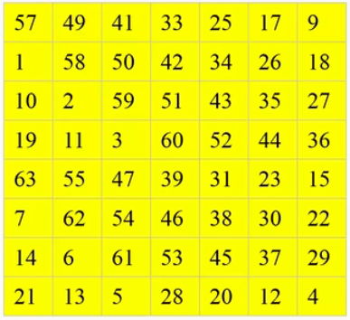

### DES算法解析及JS实现
DES是由IBM公司研制的一种对称加密算法，美国国家标准局于1977年公布把它作为非机要部门使用的数据加密标准。<br/><br/>
<strong>基本原则：</strong><br/>
DES设计中使用了分组密码设计的两个原则：混淆（confusion）和扩散(diffusion)，其目的是抗击敌手对密码系统的统计分析。混淆是使密文的统计特性与密钥的取值之间的关系尽可能复杂化，以使密钥和明文以及密文之间的依赖性对密码分析者来说是无法利用的。扩散的作用就是将每一位明文的影响尽可能迅速地作用到较多的输出密文位中，以便在大量的密文中消除明文的统计结构，并且使每一位密钥的影响尽可能迅速地扩展到较多的密文位中，以防对密钥进行逐段破译。<br/><br/>
<strong>算法入口参数：</strong><br/>
DES算法的入口参数有三个：Key、Data、Mode。其中Key为8个字节共64位，是DES算法的工作密钥；Data为8个字节64位，是要被加密或被解密的数据；Mode为DES的工作方式,有两种:加密或解密。<br/><br/>
<strong>算法步骤：</strong><br/>

1. 将要加密的信息转换成二进制并且按64位每段进行拆分，每64位作为一次Data进行转换

```
class DES {
   constructor(key, data, mode) {
      this.key = key; //密钥
      this.data = data; //加密/解密数据
      this.mode = mode || 'encryp'; //模式，模式，encryp为加密，decrypt为解密；默认加密
      ...
   }
      /*
    * 字符串转二进制
    * data 要转换的数据，默认this.data
    * digit 转换后需要补齐到多少位。如digit = 4，转换后为11，则补齐到四位数得 0011
    */
    strToBinary (data = this.data, digit = 16) {
      let result = [];
      for (let i = 0, len = data.length; i < len; ++i) {
        let code = data.charCodeAt(i).toString(2);
        code = '0000000000000000'.substring(0, digit - code.length) + code;
        result.push(code);
      }
      //保证字符串能按每64个为一组进行拆分
      if (digit === 16 && result.length > 0 && result.length % 4 !== 0) {
        for (let i = 0, time = 4 - result.length % 4; i < time; ++i) {
          result.push('0000000000100000'); //用空格补全
        }
      }
      return result.join('');
    }
    //运行方法
    work () {
      let plaintextArr = this.strToBinary().match(/.{64}/g) || []; //二进制明文数组（每64个为一组）
      let result = ''; //结果
      plaintextArr.map(plaintext => {
        result += this.plaintextDisplace(plaintext);
      });
      return result;
    }
}
```
2. 生成16个子密钥（K1,K2,K3,...K16）（子密钥根据输入的密钥进行生成，用于参与后续16轮迭代运算）
  DES算法总共需要进行16次迭代运算，每轮迭代运算使用一个子密钥，所以共需要16个子密钥，子密钥由用户输入的64位初始密钥产生，其中8位用于奇偶校验，分别位于第8、16、24、32、40、48、56、64位。奇偶校验位用于检查密钥在产生和分配以及存储过程置换可能发生的错误，这 样DES的密钥实际有效位只有56位。<br/>
<br/>
图示说明：PC-1：PC-1置换，PC-2：PC-2置换，Cn/Dn：当次置换后的数据，LSn：第n次循环左移运算

- PC-1置换<br/>
  <br/>
  输入的初始密钥K首先经过PC-1置换将比特重排。置换结果的前28位作为C0,后28位作为D0。经过该置换后不再出现第8、16、24、32、40、48、56、64位，且剩余的56位密钥打乱重排。

```
class DES {
    constructor(key, data, mode) {
     ...
      this.PC1 = [ //PC1置换表
        57, 49, 41, 33, 25, 17, 9,
        1, 58, 50, 42, 34, 26, 18,
        10, 2, 59, 51, 43, 35, 27,
        19, 11, 3, 60, 52, 44, 36,
        63, 55, 47, 39, 31, 23, 15,
        7, 62, 54, 46, 38, 30, 22,
        14, 6, 61, 53, 45, 37, 29,
        21, 13, 5, 28, 20, 12, 4
      ];
      this.subKey = this.compSubKey(key);
    }
    ...
   /*
    * 置换计算
    * binaryArr: 参与置换的二进制数组
    * type: 置换类型  IP: IP置换， PC1： PC-1置换， PC2: PC-2置换
    */
    displaceComp (binaryArr, type) {
      let result = [];
      this[type].map((resultIndex, index) => {
        result[index] = binaryArr[resultIndex - 1];
      });
      return result;
    }
    //计算子密钥
    compSubKey (key = this.key) {
      let subKey = []; //子密钥数组
      let keyBinaryArr = this.strToBinary(key, 8).split(''); //将用户输入的密钥转换成二进制数组
      let PC1Result = this.displaceComp(keyBinaryArr, 'PC1');
      ...
      return subKey;
    }
}
```
- 循环位移以及PC-2置换生成16个子密钥
  在计算第i轮迭代所用的子密钥时，先对Ci-1和Di-1进行循环左移，分别得到Ci和Di。如果i=1，2，9，16，循环左移1位，否则循环左移动2位。如下表所示：<br/>
  <br/>
  经过移位后得到Ci和Di作为下一个循环的输入，然后将Ci、Di拼合后进行PC-2置换，从56位中选取48位作为子密钥。<br/>
  <br/>
```
class DES {
    constructor(key, data, mode) {
     ...
      this.PC2 = [ //PC2置换表
        14, 17, 11, 24, 1, 5,
        3, 28, 15, 6, 21, 10,
        23, 19, 12, 4, 26, 8,
        16, 7, 27, 20, 13, 2,
        41, 52, 31, 37, 47, 55,
        30, 40, 51, 45, 33, 48,
        44, 49, 39, 56, 34, 53,
        46, 42, 50, 36, 29, 32
      ];
      this.subKey = this.compSubKey(key);
    }
    ...
    //计算子密钥
    compSubKey (key = this.key) {
      let subKey = []; //子密钥数组
      let keyBinaryArr = this.strToBinary(key, 8).split(''); //将用户输入的密钥转换成二进制数组 //将用户输入的密钥转换成二进制数组
      let PC1Result = this.displaceComp(keyBinaryArr, 'PC1');
      let left = PC1Result.slice(0, 28); //Ci
      let right = PC1Result.slice(28, 56); //Di
      let displaceRoundArr = [1, 1, 2, 2, 2, 2, 2, 2, 1, 2, 2, 2, 2, 2, 2, 1]; //循环移位用数组，数组元素值表示第i次循环需要移几位
      displaceRoundArr.map((num, index) => { //循环移位
        for(let j = 0; j < num; j++){
          left.push(left.shift());
          right.push(right.shift());
        }
        subKey[index] = this.displaceComp(left.concat(right), 'PC2'); //PC-2置换
      })
      return subKey;
    }
}
```
3. 初始置换IP<br/>
   将输入的64位明文进行一次初始置换<br/>
  <br/>

```
    this.IP = [ //初始置换表
        58, 50, 42, 34, 26, 18, 10, 2,
        60, 52, 44, 36, 28, 20, 12, 4,
        62, 54, 46, 38, 30, 22, 14, 6,
        64, 56, 48, 40, 32, 24, 16, 8,
        57, 49, 41, 33, 25, 17, 9, 1,
        59, 51, 43, 35, 27, 19, 11, 3,
        61, 53, 45, 37, 29, 21, 13, 5,
        63, 55, 47, 39, 31, 23, 15, 7
    ];
    ...
   /*
    * 明文置换
    * plaintext: 二进制明文
    */
    plaintextDisplace (plaintext) {
      let result = '';
      let IPResult = this.displaceComp(plaintext.split(''), 'IP').join(''); //IP置换结果
      ...
      return result;
    }
```

4. 16轮迭代运算<br/>
  <br/>
  在每一轮迭代中，每个64位的中间结果（第一轮用初始置换后得到的64位比特数据）被分成左右两部分，而且左右两部分作为互相独立的32位数据进行处理。每轮迭代的输入是上轮的结果Li-1和Ri-1。16轮迭代完后将左右两个数据调换位置后重新拼接成一份完整的64位数据。

```
   /*
    * 明文置换
    * plaintext: 二进制明文
    */
    plaintextDisplace (plaintext) {
      let result = '';
      let IPResult = this.displaceComp(plaintext.split(''), 'IP').join(''); //IP置换结果
      let iterationResult = this.iteration(IPResult.substring(0, 32), IPResult.substring(32), 0).split(''); //迭代结果
      ...
      return result;
    }

   /*
    * 迭代运算
    * left  左数据 Li
    * right 右数据 Ri
    * round 当前轮数
    */
    iteration (left, right, round) {
      if (round > 15) {
        return right + left;
      } else {
        let newLeft = right;
        let newRight;
        ...
        return this.iteration(newLeft, newRight, ++round);
      }
    }
```
- 扩展置换<br/>
  <br/>
  Ri-1先通过扩展置换由32位扩展为48位，扩展函数将32位的明文每4位分成一组，共8组。每个分组将4位扩展为6位，扩展方法为：每个分组的4位数作为6位输出分组的中间四位，6位输出分组中的第1位和第6位分别由相邻的两个四位小组的最外面两位扩散进入到本分组产生。其中第1个分组的左侧相邻分组为最后一个分组。

```
   /*
    * 迭代运算
    * left  左数据 Li
    * right 右数据 Ri
    * round 当前轮数
    */
    iteration (left, right, round) {
      if (round > 15) {
        return right + left;
      } else {
        let newLeft = right;
        let newRight;
        let extendedResult = this.extendedPermutation(right); //扩展置换结果
        ...
        return this.iteration(newLeft, newRight, ++round);
      }
    }
   /*
    * 扩展置换
    * plaintext: 二进制数据
    */
    extendedPermutation (plaintext) {
      let plainArr = plaintext.split('');
      let resultArr = [];
      plainArr.map((plain, index) => {
        let remainder = index % 4;
        if (index === 0) {
          resultArr.push(plainArr[plainArr.length -1], plain);
        } else if (index === plainArr.length -1) {
          resultArr.push(plain, plainArr[0]);
        } else {
          switch (remainder) {
            case 0:
              resultArr.push(plainArr[index -1], plain);
              break;
            case 3:
              resultArr.push(plain, plainArr[index +1]);
              break;
            default:
              resultArr.push(plain);
          }
        }
      })
      return resultArr
    }
```
- 与对应子密钥异或
  扩展置换之后得到的结果需要与对应轮次的子密钥进行一次异或操作
  
```
   /*
    * 迭代运算
    * left  左数据 Li
    * right 右数据 Ri
    * round 当前轮数
    */
    iteration (left, right, round) {
      if (round > 15) {
        return left + right;
      } else {
        let newLeft = right;
        let newRight;
        let extendedResult = this.extendedPermutation(right); //扩展置换结果
        let xorSubKeyResult = this.xorComp(extendedResult, this.subKey[this.mode === 'encryp' ? round : (15 - round)]); //扩展置换结果与对应的子密钥进行异或的结果
        ...
        return this.iteration(newLeft, newRight, ++round);
      }
    }
   /*
    * 异或运算
    * leftArr: 二进制数据数组
    * rightArr: 二进制数据数组
    */
    xorComp (leftArr, rightArr) {
      return leftArr.map((leftItem, index) => {
        return (leftItem ^ rightArr[index]) + '';
      })
    }
```

- S盒变换<br/>
  S盒变换是将与子密钥异或得到的结果作为S盒变换的输入，经过变换得到32位输出。DES加密函数中共有8个S盒，每个S盒有4行16列<br/>
  <br/>
  S盒变换过程：将48位输入每6比特为一组，分成8组，分别作为8个S盒的输入；每一个分组用于进行一次对应的S盒变换操作（即分组2由S1盒进行变换操作，分组2由S2盒进行）。<br/>
  假设第i个S盒的输入为B<sub>i</sub>=b<sub>1</sub>b<sub>2</sub>b<sub>3</sub>b<sub>4</sub>b<sub>5</sub>b<sub>6</sub>；将b<sub>1</sub>b<sub>6</sub>，b<sub>2</sub>b<sub>3</sub>b<sub>4</sub>b<sub>5</sub>作为两个二进制数，然后转为十进制数对应得到r和c，则通过r 和c得到第i个S盒的第r行第c列的整数N（注意此处r和c都是从0开始的），将N转换为对应的四位二进制数即是本次S盒变换得到的输出。<br/>
  完成8次S盒变换后得到8个四位数的二进制数，依次将这8个二进制数进行拼接得到的32位二进制数则是完整的S盒变换输出。

```

      this.S_Box = [
        // S1 
        [
          [14, 4, 13, 1, 2, 15, 11, 8, 3, 10, 6, 12, 5, 9, 0, 7],
          [0, 15, 7, 4, 14, 2, 13, 1, 10, 6, 12, 11, 9, 5, 3, 8],
          [4, 1, 14, 8, 13, 6, 2, 11, 15, 12, 9, 7, 3, 10, 5, 0],
          [15, 12, 8, 2, 4, 9, 1, 7, 5, 11, 3, 14, 10, 0, 6, 13]
        ],
        // S2 
        [
          [15, 1, 8, 14, 6, 11, 3, 4, 9, 7, 2, 13, 12, 0, 5, 10],
          [3, 13, 4, 7, 15, 2, 8, 14, 12, 0, 1, 10, 6, 9, 11, 5],
          [0, 14, 7, 11, 10, 4, 13, 1, 5, 8, 12, 6, 9, 3, 2, 15],
          [13, 8, 10, 1, 3, 15, 4, 2, 11, 6, 7, 12, 0, 5, 14, 9]
        ],
        // S3 
        [
          [10, 0, 9, 14, 6, 3, 15, 5, 1, 13, 12, 7, 11, 4, 2, 8],
          [13, 7, 0, 9, 3, 4, 6, 10, 2, 8, 5, 14, 12, 11, 15, 1],
          [13, 6, 4, 9, 8, 15, 3, 0, 11, 1, 2, 12, 5, 10, 14, 7],
          [1, 10, 13, 0, 6, 9, 8, 7, 4, 15, 14, 3, 11, 5, 2, 12]
        ],
        // S4 
        [
          [7, 13, 14, 3, 0, 6, 9, 10, 1, 2, 8, 5, 11, 12, 4, 15],
          [13, 8, 11, 5, 6, 15, 0, 3, 4, 7, 2, 12, 1, 10, 14, 9],
          [10, 6, 9, 0, 12, 11, 7, 13, 15, 1, 3, 14, 5, 2, 8, 4],
          [3, 15, 0, 6, 10, 1, 13, 8, 9, 4, 5, 11, 12, 7, 2, 14]
        ],
        // S5 
        [
          [2, 12, 4, 1, 7, 10, 11, 6, 8, 5, 3, 15, 13, 0, 14, 9],
          [14, 11, 2, 12, 4, 7, 13, 1, 5, 0, 15, 10, 3, 9, 8, 6],
          [4, 2, 1, 11, 10, 13, 7, 8, 15, 9, 12, 5, 6, 3, 0, 14],
          [11, 8, 12, 7, 1, 14, 2, 13, 6, 15, 0, 9, 10, 4, 5, 3]
        ],
        // S6 
        [
          [12, 1, 10, 15, 9, 2, 6, 8, 0, 13, 3, 4, 14, 7, 5, 11],
          [10, 15, 4, 2, 7, 12, 9, 5, 6, 1, 13, 14, 0, 11, 3, 8],
          [9, 14, 15, 5, 2, 8, 12, 3, 7, 0, 4, 10, 1, 13, 11, 6],
          [4, 3, 2, 12, 9, 5, 15, 10, 11, 14, 1, 7, 6, 0, 8, 13]
        ],
        // S7 
        [
          [4, 11, 2, 14, 15, 0, 8, 13, 3, 12, 9, 7, 5, 10, 6, 1],
          [13, 0, 11, 7, 4, 9, 1, 10, 14, 3, 5, 12, 2, 15, 8, 6],
          [1, 4, 11, 13, 12, 3, 7, 14, 10, 15, 6, 8, 0, 5, 9, 2],
          [6, 11, 13, 8, 1, 4, 10, 7, 9, 5, 0, 15, 14, 2, 3, 12]
         ],
        // S8 
        [
          [13, 2, 8, 4, 6, 15, 11, 1, 10, 9, 3, 14, 5, 0, 12, 7],
          [1, 15, 13, 8, 10, 3, 7, 4, 12, 5, 6, 11, 0, 14, 9, 2],
          [7, 11, 4, 1, 9, 12, 14, 2, 0, 6, 10, 13, 15, 3, 5, 8],
          [2, 1, 14, 7, 4, 10, 8, 13, 15, 12, 9, 0, 3, 5, 6, 11]
        ]
    ]
    ...
   /*
    * 迭代运算
    * left  左数据 Li
    * right 右数据 Ri
    * round 当前轮数
    */
    iteration (left, right, round) {
      if (round > 15) {
        return right + left;
      } else {
        let newLeft = right;
        let newRight;
        let extendedResult = this.extendedPermutation(right); //扩展置换结果
        let xorSubKeyResult = this.xorComp(extendedResult, this.subKey[this.mode === 'encryp' ? round : (15 - round)]); //扩展置换结果与对应的子密钥进行异或的结果
        let sBoxResult = this.SBoxComp(xorSubKeyResult); //s盒转换结果
        ...
        return this.iteration(newLeft, newRight, ++round);
      }
    }
    }
   /*
    * 十进制转二进制
    * num 要转换的十进制数据
    * digit 转换后需要补齐到多少位。如digit = 4，转换后为11，则补齐到四位数得 0011
    */
    decimalToBinary (num, digit) {
      let code = num.toString(2);
      if (digit) {
        code = '0000000000000000'.substring(0, digit - code.length) + code;
      }
      return code;
    }
   /*
    * S盒变换
    * plainArr: 48位二进制数据数组
    */
    SBoxComp (plainArr) {
      let result = [];
      for (let i = 0; i < 8; ++i) {
        let starIndex = i * 6; //48位数组分割为8组后每组数据在原数组中的开始索引
        let row = parseInt(plainArr[starIndex] + plainArr[starIndex + 5], 2); //行
        let col = parseInt(plainArr.slice(starIndex + 1, starIndex + 5).join(""), 2); //列
        let boxIResult = this.decimalToBinary(this.S_Box[i][row][col], 4).split(''); //第i次盒变换得到的四位二进制数组结果
        result = result.concat(boxIResult);
      }
      return result;
    }
```
- P盒置换
  将S盒输出的32位二进制数根据固定的置换P置换得到相应的位置。P盒置换后得到的输出与左半部异或得到的结果将作为下一轮迭代的右半部分。<br/>
  <br/>
  
```
   this.P = [
     16, 7, 20, 21, 29, 12, 28, 17,
     1, 15, 23, 26, 5, 18, 31, 10,
     2, 8, 24, 14, 32, 27, 3, 9,
     19, 13, 30, 6, 22, 11, 4, 25
   ]
  ...
   /*
    * 迭代运算
    * left  左数据 Li
    * right 右数据 Ri
    * round 当前轮数
    */
    iteration (left, right, round) {
      if (round > 15) {
        return right + left;
      } else {
        let newLeft = right;
        let newRight;
        let extendedResult = this.extendedPermutation(right); //扩展置换结果
        let xorSubKeyResult = this.xorComp(extendedResult, this.subKey[this.mode === 'encryp' ? round : (15 - round)]); //扩展置换结果与对应的子密钥进行异或的结果
        let sBoxResult = this.SBoxComp(xorSubKeyResult); //s盒转换结果
        let PResult = this.displaceComp(sBoxResult, 'P'); //P盒置换结果
        newRight = this.xorComp(left.split(''), PResult).join('');
        return this.iteration(newLeft, newRight, ++round);
      }
    }
```

4. 逆初始置换IP<sup>-1<sup><br/>
  64位的明文经过IP置换、16轮迭代运算后再经过一次逆初始置换后得到的二进制结果再转换为字符串即是DES加密的密文输出。<br/>
  <br/>

```
  this.IP_1 = [
    40, 8, 48, 16, 56, 24, 64, 32,
    39, 7, 47, 15, 55, 23, 63, 31,
    38, 6, 46, 14, 54, 22, 62, 30,
    37, 5, 45, 13, 53, 21, 61, 29,
    36, 4, 44, 12, 52, 20, 60, 28,
    35, 3, 43, 11, 51, 19, 59, 27,
    34, 2, 42, 10, 50, 18, 58, 26,
    33, 1, 41, 9, 49, 17, 57, 25
  ]
  ...
   /*
    * 二进制转字符串
    * binary: 二进制数据
    */
    binaryToStr (binary = '') {
      let list = binary.match(/.{16}/g); //每16个二进制转换成一个字符
      let result = list.map(code => {
        return String.fromCharCode(parseInt(code, 2))
      });
      return result.join('').trim();
    }
    
    /*
    * 明文置换
    * plaintext: 二进制明文
    */
    plaintextDisplace (plaintext) {
      let result = '';
      let IPResult = this.displaceComp(plaintext.split(''), 'IP').join(''); //IP置换结果
      let iterationResult = this.iteration(IPResult.substring(0, 32), IPResult.substring(32), 0).split(''); //迭代结果
      let IP_1Result = this.displaceComp(iterationResult, 'IP_1').join(''); //逆初始置换结果
      result = this.binaryToStr(IP_1Result); //转回字符串
      return result;
    }
```

5. 解密<br/>
  加密和解密可以使用相同的算法。加密和解密唯一不同的是秘钥的次序是相反的。就是说如果每一轮的加密秘钥分别是K1、K2、K3...K16，那么解密秘钥就是K16、K15、K14...K1。