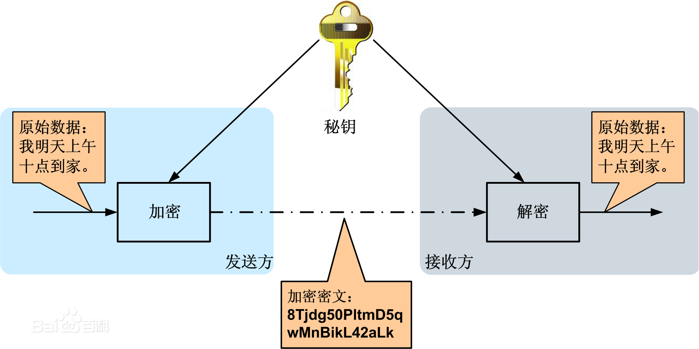

### 对称加密和非对称加密
#### 1.对称加密
采用单钥密码系统的加密方法，同一个密钥可以同时用作信息的加密和解密，这种加密方法称为对称加密，也称为单密钥加密。对称即采用这种加密方法的双方使用同样的密钥进行加密和解密，因此加密的安全性不仅取决于加密算法本身，密钥管理的安全性更是重要。因为加密和解密都使用同一个密钥，如何把密钥安全地传递到解密者手上就成了必须要解决的问题。  
<strong>流程：</strong>
数据发送方将明文（原始数据）和加密密钥一起经过特殊加密算法处理后，使其变成复杂的加密密文发送出去。接收方收到密文后，若想解读原文，则需要使用加密密钥及相同算法的逆算法对密文进行解密，才能使其恢复成可读明文。在对称加密算法中，使用的密钥只有一个，发收信双方都使用这个密钥对数据进行加密和解密。 

<strong>常用算法：</strong> 
- DES（Data Encryption Standard）：数据加密标准，速度较快，适用于加密大量数据的场合；
- 3DES（Triple DES）：是基于DES，对一块数据用三个不同的密钥进行三次加密，强度更高；
- AES（Advanced Encryption Standard）：高级加密标准，是下一代的加密算法标准，速度快，安全级别高，支持128、192、256、512位密钥的加密；

<strong>算法特征：</strong> 
- 加密方和解密方使用同一个密钥；
- 加密解密的速度比较快，适合数据比较长时的使用；
- 密钥传输的过程不安全，且容易被破解，密钥管理也比较麻烦；

<strong>优点：</strong>算法公开、计算量小、加密速度快、加密效率高  
<strong>缺点：</strong>称加密算法的缺点是在数据传送前，发送方和接收方必须商定好秘钥，然后使双方都能保存好秘钥。其次如果一方的秘钥被泄露，那么加密信息也就不安全了。另外，每对用户每次使用对称加密算法时，都需要使用其他人不知道的独一秘钥，这会使得收、发双方所拥有的钥匙数量巨大，密钥管理成为双方的负担。  
<strong>具体实现：</strong>在每次发送真实数据前，服务端会先生成一把密钥，然后把密钥传输给客户端。之后客户端与服务端的通信传输数据时都会用这把密钥对数据进行加密与解密 

<strong>附：</strong>[DES算法解析及JS实现](https://github.com/DSDTWeb/blog/blob/master/JavaScript/%E5%AF%B9%E7%A7%B0%E5%8A%A0%E5%AF%86%E4%B8%8E%E9%9D%9E%E5%AF%B9%E7%A7%B0%E5%8A%A0%E5%AF%86/DES%E7%AE%97%E6%B3%95%E8%A7%A3%E6%9E%90%E5%8F%8AJS%E5%AE%9E%E7%8E%B0.md)
  
#### 2.非对称加密
非对称加密算法需要两个密钥：公开密钥（publickey:简称公钥）和私有密钥（privatekey:简称私钥）。公钥与私钥是一对，如果用公钥对数据进行加密，只有用对应的私钥才能解密。因为加密和解密使用的是两个不同的密钥，所以这种算法叫作非对称加密算法。  
<strong>密钥的形式：</strong>公钥与私钥是一对的，数据传输双方均有一对密钥。（即双方共有四把密钥）  
<strong>工程原理：</strong> 
1.A要向B发送信息，A和B都要产生一对用于加密和解密的公钥和私钥。 
2.A的私钥保密，A的公钥告诉B；B的私钥保密，B的公钥告诉A。 
3.A要给B发送信息时，A用B的公钥加密信息，因为A知道B的公钥。 
4.A将这个消息发给B（已经用B的公钥加密消息）。 
5.B收到这个消息后，B用自己的私钥解密A的消息。其他所有收到这个报文的人都无法解密，因为只有B才有B的私钥。  
<strong>优点：</strong>安全性较高，比对称密钥安全性高很多。  
<strong>缺点：</strong>算法复杂，而使得加密解密速度没有对称加密解密的速度快。  
<strong>图解：</strong> 
 

<html>
<!--在这里插入内容-->
</html>

